<div align="center">
  
</div>

<p align="center">
  <a href="https://git.io/typing-svg">
    
  </a>
</p>

<p align="center">
  
  
  
  
  
  
</p>

<p align="center">
  <b>Formerly known as</b> <code>OSINT-EYE</code> &nbsp;|&nbsp; <b>Now rebranded to</b> <code>Horizon-Intel</code>
</p>

---

## 📋 Table of Contents

- [Overview](#-overview)
- [Architecture](#-architecture)
- [Features](#-features)
- [Modules](#-modules)
- [Quick Start](#-quick-start)
- [Usage Examples](#-usage-examples)
- [Web Dashboard](#-web-dashboard)
- [Configuration](#-configuration)
- [Roadmap](#-roadmap)
- [Contributing](#-contributing)
- [License](#-license)

---

## 🌐 Overview

**Horizon-Intel** is a modular **Open-Source Intelligence (OSINT)** and **Attack Surface Reconnaissance** platform. It automates data collection from public sources — DNS records, certificate transparency logs, web archives, WHOIS, GitHub code search, Google dorking, and NVD/CVE databases — and correlates findings into actionable intelligence.

Built from the ground up as a comprehensive recon toolkit, it serves penetration testers, bug bounty hunters, SOC analysts, and security researchers.

### Why Horizon-Intel?

| Capability | Description |
|------------|-------------|
| 🔍 **DNS Reconnaissance** | Subdomain enumeration, permutation, zone walking, takeover detection |
| 🔐 **Certificate Intelligence** | Certificate transparency log scanning via crt.sh |
| 🌐 **Web History** | Wayback Machine URL enumeration and content discovery |
| 🖧 **Network Scanning** | Port scanning via python-nmap |
| 🕵️ **OSINT Dorking** | GitHub code search + Google dorking automation |
| 📋 **Vulnerability Lookup** | CVE/NVD database queries via nvdlib |
| 🧠 **Correlation Engine** | Cross-references findings across all modules |
| 📊 **Graph Analysis** | Entity relationship mapping and attack surface visualization |
| 🤖 **AI Integration** | Local LLM analysis via Ollama |
| 📝 **Reporting** | Markdown and PDF report generation with MITRE ATT&CK mapping |
| 🌐 **Web Dashboard** | Flask-based interactive dashboard with D3.js visualization |

---

## 🏗 Architecture


### Data Flow

```mermaid
flowchart TD
    subgraph Sources["🌐 Public Sources"]
        S1[DNS / WHOIS]
        S2[Certificate Logs]
        S3[Wayback Machine]
        S4[GitHub Search]
        S5[Google Search]
        S6[NVD / CVE]
    end

    subgraph Collectors["📡 Collectors"]
        C1[DNS Scanner]
        C2[Cert Scanner]
        C3[Wayback Scanner]
        C4[GitHub Dorker]
        C5[Google Dorker]
        C6[NVD Lookup]
    end

    subgraph Processing["⚙️ Processing"]
        P1[Parser]
        P2[Deduplicator]
        P3[Enricher]
    end

    subgraph Storage["💾 Storage"]
        DB[(In-Memory)]
        CA[(SQLite Cache)]
    end

    subgraph Analysis["📊 Analysis"]
        A1[Correlation Engine]
        A2[Graph Analysis]
        A3[Timeline Builder]
        A4[LLM Analysis]
    end

    subgraph Output["📤 Output"]
        O1[Dashboard]
        O2[Markdown Reports]
        O3[PDF Reports]
        O4[MITRE Mapping]
    end

    Sources --> Collectors
    Collectors --> Processing
    Processing --> Storage
    Storage --> Analysis
    Analysis --> Output
```



---

## ✨ Features

### 🔬 Reconnaissance Modules
- **DNS Enumeration**: A, AAAA, MX, NS, TXT, CNAME, SOA records; subdomain brute-force; certificate transparency (crt.sh); subdomain permutation with takeover detection
- **Web Intelligence**: Wayback Machine URL history, JavaScript endpoint discovery, technology fingerprinting
- **Certificate Analysis**: SSL certificate transparency log scanning
- **Network Scanning**: Port and service discovery via `python-nmap`
- **WHOIS Lookups**: Domain registration and ownership data

### 🕵️ OSINT Dorking
- **GitHub Dorking**: Automated code search for API keys, credentials, AWS secrets, private keys, database connection strings, config files
- **Google Dorking**: Automated search for login pages, admin panels, sensitive files, config files, backup files

### 📋 Vulnerability Intelligence
- **NVD/CVE Lookup**: Query the National Vulnerability Database for known vulnerabilities affecting discovered services

### 🧠 AI Integration
- **Ollama Engine**: Local LLM analysis of reconnaissance results for additional insights (fully offline, no cloud dependency)

### 🔗 Correlation & Analysis
- **Asset Correlator**: Cross-references DNS, certificate, network, and web data to build a unified asset inventory
- **Graph Builder**: Entity relationship graph with interactive HTML visualization (powered by vis-network)
- **Scan Diff Engine**: Compare results between targets and generate bounty-style reports
- **MITRE ATT&CK Mapping**: Maps findings to the MITRE ATT&CK framework

### 📝 Reporting
- **Markdown Reporter**: Human-readable Markdown reports with sections per module
- **PDF Reporter**: Professional PDF reports via ReportLab
- **Bounty Reporter**: Bug-bounty-style formatted reports
- **Neo4j Export**: Export relationship graph to Cypher queries

### 🌐 Web Dashboard
- Flask + D3.js interactive dashboard
- REST API for scan results
- Subdomain, port, graph, and MITRE visualization

---

## 🧩 Modules

| Module | File | Description |
|--------|------|-------------|
| **DNS Scanner** | `modules/dns/dns_scanner.py` | DNS record enumeration, subdomain discovery |
| **Advanced DNS** | `modules/dns/advanced_dns.py` | Zone walking, DNSSEC, AXFR attempts |
| **Subdomain Permutator** | `modules/dns/subdomain_permutator.py` | Subdomain permutation + takeover detection |
| **Cert Scanner** | `modules/certs/cert_scanner.py` | Certificate transparency (crt.sh) scanning |
| **Web Scanner** | `modules/web/web_scanner.py` | Technology fingerprinting, endpoint discovery |
| **Wayback Scanner** | `modules/web/wayback.py` | Wayback Machine URL history |
| **Network Scanner** | `modules/network/scanner.py` | Port scanning via python-nmap |
| **WHOIS Scanner** | `modules/osint/whois.py` | Domain WHOIS lookups |
| **GitHub Dorker** | `modules/osint/github.py` | GitHub code search dorking |
| **Google Dorker** | `modules/osint/google.py` | Google search dorking |
| **Cloud/Email** | `modules/osint/cloud_email.py` | Cloud bucket detection, email enumeration, CDN detection |
| **CVE Scanner** | `modules/cve/nvd.py` | NVD vulnerability database queries |
| **AI Engine** | `ai/llm_engine.py` | Ollama local LLM analysis |
| **Correlation** | `core/correlator.py` | Cross-module asset correlation |
| **Graph Builder** | `graph/builder.py` | Relationship graph with vis-network |
| **Scan Diff** | `core/scan_diff.py` | Target comparison and diff reports |
| **MITRE Mapper** | `reporting/mitre_mapper.py` | MITRE ATT&CK framework mapping |
| **Monitor** | `core/monitor.py` | Subdomain monitoring and alerting |
| **Plugins** | `core/plugins.py` | Plugin loading system |

---

## 🚀 Quick Start

### Prerequisites

```bash
# Python 3.10+
python --version  # > 3.10.x

# Optional but recommended: nmap for network scanning
nmap --version
```

### Installation

```bash
# Clone the repository
git clone https://github.com/Ruby570bocadito/Horizon-Intel.git
cd Horizon-Intel

# Create virtual environment
python -m venv venv
source venv/bin/activate  # On Windows: venv\Scripts\activate

# Install dependencies
pip install -r requirements.txt
```

### Run

```bash
# Basic reconnaissance on a domain
python osint_eye.py example.com

# Full scan with AI analysis
python osint_eye.py example.com --depth full --rich

# Scan multiple targets
python osint_eye.py example.com test.com --stealth

# Launch the web dashboard
python osint_eye.py example.com --dashboard

# Generate a PDF report
python osint_eye.py example.com --pdf

# Or with Docker
docker build -t horizon-intel .
docker run --rm horizon-intel example.com
```

---

## 💻 Usage Examples

### Basic Domain Reconnaissance

```bash
# Quick scan with default modules
python osint_eye.py example.com

# Stealth mode (slower, lower footprint)
python osint_eye.py example.com --stealth

# In-depth scan with AI module
python osint_eye.py example.com --depth full --rich
```

### View Available Modules

```bash
python osint_eye.py --modules
```

### Compare Two Targets

```bash
python osint_eye.py example.com evil.example.com --diff
```

### Continuous Monitoring

```bash
# Monitor subdomains of a domain
python osint_eye.py example.com --monitor --monitor-interval 3600
```

### Web Dashboard

```bash
# Scan and launch dashboard
python osint_eye.py example.com --dashboard

# Then visit: http://localhost:5000
```

### Generate Reports

```bash
# Markdown report
python osint_eye.py example.com -o report.md

# PDF report
python osint_eye.py example.com --pdf

# Export full results as JSON
python osint_eye.py example.com -o results.json
```

### Export to Neo4j

```bash
python osint_eye.py example.com --export-cypher results.cypher
```

### AI-Powered Analysis (requires Ollama)

```bash
# Install Ollama: https://ollama.ai
ollama pull llama3.2

# Run with AI analysis
python osint_eye.py example.com --agent

# Disable AI if desired
python osint_eye.py example.com --no-ai
```

### Webhook Alerts

```bash
python osint_eye.py example.com --monitor --webhook https://hooks.slack.com/services/xxx
```

---

## 🌐 Web Dashboard

Horizon-Intel includes a Flask + D3.js-based web dashboard for interactive visualization of scan results.

```bash
# Method 1: Scan and launch dashboard together
python osint_eye.py example.com --dashboard

# Method 2: Load existing results into dashboard
python ui/dashboard.py results.json
```

Then open **http://localhost:5000** in your browser.

The dashboard provides:
- Scan summary with statistics
- Subdomain list with source attribution
- Open ports and services table
- Interactive relationship graph
- MITRE ATT&CK mapping visualization

### REST API Endpoints

Once the dashboard is running, you can query results programmatically:

```bash
# List all scans
curl http://localhost:5000/api/scans

# Get scan details
curl http://localhost:5000/api/scan/example.com

# Get discovered subdomains
curl http://localhost:5000/api/scan/example.com/subdomains

# Get open ports
curl http://localhost:5000/api/scan/example.com/ports

# Get relationship graph
curl http://localhost:5000/api/scan/example.com/graph

# Get MITRE ATT&CK mapping
curl http://localhost:5000/api/scan/example.com/mitre
```

---

## ⚙️ Configuration

Horizon-Intel is configured via CLI flags and a setup wizard. Run the wizard to customize your scan profile:

```bash
python osint_eye.py --wizard
```

### Key CLI Options

| Flag | Description |
|------|-------------|
| `targets` | Target domain(s) or IP(s) (positional argument) |
| `--stealth` | Enable stealth mode (lower request rate) |
| `--no-ai` | Disable AI analysis module |
| `--no-cache` | Disable SQLite result caching |
| `--output -o` | Output file path (JSON/MD auto-detected) |
| `--depth` | Scan depth (`quick`, `normal`, `full`) |
| `--diff` | Show comparison between multiple targets |
| `--rich` | Use Rich TUI output format |
| `--dashboard` | Launch web dashboard after scan |
| `--monitor` | Enable continuous monitoring mode |
| `--monitor-interval` | Monitoring interval in seconds |
| `--webhook` | Webhook URL for alerts |
| `--agent` | Enable AI agent analysis mode |
| `--export-cypher` | Export graph to Neo4j Cypher file |
| `--pdf` | Generate PDF report |
| `--modules` | List all available modules |

---

## 🗺 Roadmap

- [x] Core DNS and web reconnaissance (v1.0)
- [x] GitHub and Google dorking engines (v1.5)
- [x] Web dashboard with graph visualization (v2.0)
- [x] PDF and MITRE ATT&CK reporting (v2.0)
- [x] Correlation engine and scan diff (v2.0)
- [x] AI integration via Ollama (v2.0)
- [ ] Integration with Shodan / Censys APIs
- [ ] Real-time alerting system with notifications
- [ ] Historical scan trend analysis
- [ ] Plugin marketplace
- [ ] Masscan integration for faster network scanning

---

## 🤝 Contributing

Contributions are what make the open source community amazing! Any contributions you make are **greatly appreciated**.

1. Fork the Project
2. Create your Feature Branch (`git checkout -b feature/AmazingFeature`)
3. Commit your Changes (`git commit -m 'Add some AmazingFeature'`)
4. Push to the Branch (`git push origin feature/AmazingFeature`)
5. Open a Pull Request

---

## 📄 License

Distributed under the **MIT License**. See `LICENSE` for more information.

---

<p align="center">
  <b>Horizon-Intel</b> — Open-Source Intelligence & Attack Surface Reconnaissance Platform
  <br>
  <a href="https://github.com/Ruby570bocadito/Horizon-Intel">GitHub</a>
  ·
  <a href="https://github.com/Ruby570bocadito/Horizon-Intel/issues">Report Bug</a>
  ·
  <a href="https://github.com/Ruby570bocadito/Horizon-Intel/issues">Request Feature</a>
</p>

<p align="center">
  
</p>
